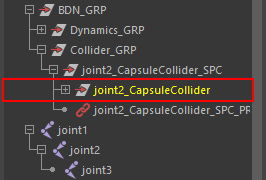

# nkBdnEditor

[](https://github.com/imaoki/nkBdnEditor/releases/latest)

[boneDynamicsNode](https://github.com/akasaki1211/boneDynamicsNode)のセットアップ、および編集を行うMELツール。

## 特徴

* リグへの後付けをサポート

* アトリビュートや各種接続の一括編集

* アトリビュートの書き出し/読み込み

* 3種類（カプセル/無限平面/球）のカスタムコライダー

* コライダーの書き出し/読み込み

## デモ

* ダイナミクスユニットの作成

  

* コライダーの作成と割り当て

  

## 要件

* [akasaki1211/boneDynamicsNode](https://github.com/akasaki1211/boneDynamicsNode)

## 開発環境

Maya 2022.5 / Windows 10

## インストール

01. `nkBdnEditor.mel` をスクリプトディレクトリにコピー

    | バージョン | ディレクトリ                             |
    | ---------- | ---------------------------------------- |
    | 英語版     | `%MAYA_APP_DIR%\<version>\scripts`       |
    | 日本語版   | `%MAYA_APP_DIR%\<version>\ja_JP\scripts` |

02. Mayaを再起動

## 起動方法

```mel
nkBdnEditor;
```

## 使い方

### ダイナミクスユニット


01. 対象のコントロールノードを選択

02. *Create Dynamics Unit* を実行

### コライダー

#### 基本


01. 任意のコライダーを作成

02. *Collider List > All* からコライダーを選択

03. *BoneDynamicsNode List* で割り当てたいBDNを選択

04. *Append* を実行

#### 拘束されたコライダー

体や武器等にコライダーをリンクさせたい場合に使用します。


01. *Create and constrain...* のチェックボックスをオンにする

02. コライダーを拘束させたいノードを順に選択

03. 任意のコライダーを作成

04. 必要に応じて終端の不要なコライダーを削除

05. 適宜BDNに割り当て

##### 配置規則

* コライダーは選択ノードの位置に作成されます。

* Capsule特有の規則

  * ノード間の距離に基づいて *Collider Length* が設定されます。

  * 終端のコライダーが不要な場合は適宜削除してください。

  * +X軸が子ノードを向いていることを前提としています。
    軸の向きが異なる場合やメッシュ形状に合わない場合は空間ノードではなくその下のコライダー自体を移動/回転させてください。

    

  * 選択の順序に注意してください。

    正しく作成するには階層順に選択してください。

    

    選択順に処理されるため変則的に選択するとこのようになります。

    

  * 分岐がある場合は枝ごとに分けて作成してください。

#### 種類

* Capsule

  

  | アトリビュート      | 説明                               |
  | ------------------- | ---------------------------------- |
  | *Collider Radius A* | 始点の半径                         |
  | *Collider Radius B* | 終点の半径                         |
  | *Collider Length*   | 始点から終点までの長さ（負数も可） |
  | *Collider Offset*   | X軸方向のオフセット                |
  | *Collider Pivot*    | X軸方向の中心                      |

* Infinite Plane

  

  | アトリビュート    | 説明 |
  | ----------------- | ---- |
  | *Collider Width*  | 幅   |
  | *Collider Height* | 高さ |

  幅、高さ共に機能的な意味はありません。視覚的な分かりやすさのために設けてあります。

* Sphere

  

  | アトリビュート    | 説明 |
  | ----------------- | ---- |
  | *Collider Radius* | 半径 |

### メッシュコライダー

01. *BoneDynamicsNode List* で割り当てたいBDNを選択

02. 任意のメッシュオブジェクトを選択

03. *Append* を実行

### フォース

[Additional Force](https://github.com/akasaki1211/boneDynamicsNode?tab=readme-ov-file#additional-force--turbulence-force) をノードの任意の軸方向で制御できるように接続します。

01. *BoneDynamicsNode List* で割り当てたいBDNを選択

02. 任意のノードを選択

03. *Append* を実行

    * 一つのBDNには一つのノードしか割り当てられません。

    * 複数選択した場合は最後のノードが割り当てられます。

04. 必要に応じて *Force Vector* を設定

### オフセット

[Offset Transform](https://github.com/akasaki1211/boneDynamicsNode?tab=readme-ov-file#offset-transform) に使用するノードを接続します。

01. *BoneDynamicsNode List* で割り当てたいBDNを選択

02. 任意のノードを選択

03. *Append* を実行

    * 一つのBDNには一つのノードしか割り当てられません。

    * 複数選択した場合は最後のノードが割り当てられます。

04. 適宜 *Offset Matrix Weight* の値を調整

    

### ベイク

01. *BoneDynamicsNode List* でベイクしたいBDNを選択

02. *Bind List* でベイクするコントロールノードを選択

03. 時間範囲を設定して *Bake* を実行

    * ベイクはRotateアトリビュートに対して行われます。

#### 再接続

*Rebind* を実行するとベイクしたアニメーションを削除してダイナミクスユニットと再接続します。
現在のところコントロールノードがBaseAnimationレイヤにのみ属している前提で正しく機能します。

### 関連ノードの削除

> [!CAUTION]
> いずれの場合も関連ノードがセットのメンバーになっている場合は削除されないので注意してください。

#### ダイナミクスユニット

階層ごとの空間ノードを削除してください。


#### コライダー

コライダーごとの空間ノードを削除してください。
削除してもコライダーの影響が残ってしまう場合は、削除前までアンドゥして接続を切ってから再度削除してください。


#### 全ての関連ノード

BDNグループごと削除してください。


## その他

### 共通機能

| ボタン                                                                     | 機能                                           |
| -------------------------------------------------------------------------- | ---------------------------------------------- |
|   | 階層表示の有効化                               |
|                         | 選択ノードからリストの項目を選択する           |
|                    | 選択項目のノードを表示する                     |
|                     | 選択項目のノードを非表示にする                 |
|      | 選択項目の空間ノードを選択する                 |
|                  | 選択項目のノードを選択する                     |
|  | 選択項目のアトリビュートを初期化する           |
|             | 選択項目の内容をファイルに書き出す             |
|             | ファイルから選択項目に内容を読み込む           |
|               | 選択項目の内容を内部キャッシュにコピーする     |
|            | 内部キャッシュから選択項目に内容をペーストする |

### ダイナミクスユニットの階層構造

ダイナミクスユニットの作成では、選択したコントロールノードの階層を探索して親子関係を考慮した階層構造を構築します。

#### 特殊なリグ

稀に一見単純なFKチェーンなのに個々のコントロールノードが独立した階層になっているリグがあります。
そのような場合でも問題なく構築できますが、あくまで複数のダイナミクスユニットを連結した構造になりますので、後で個別に終端ジョイントのオフセット調整が必要になります。

赤色のFKチェーンは一つの階層、水色のFKチェーンは個別に階層が分かれています。


### ダイナミクスユニット作成オプション


#### Branch Handling

分岐は[この方法](https://github.com/akasaki1211/boneDynamicsNode?tab=readme-ov-file#branching)に倣って処理します。
基本的な捉え方はエイムコンストレイントと同じなので説明は省略します。

#### End Joint

一つのboneDynamicsNodeには必ず終端ジョイントが必要です。
ここで終端ジョイントを作成する際のオフセット値を定義します。
作成後にチャンネルボックスで修正できますので適当な値で構いません。

### リファレンスノード

リファレンスノードは次のように先頭に `^` 記号が付きます。


### インポート時の処理

リファレンスではない編集可能なBDNグループはシーンに一つのみ存在できます。
BDNグループが含まれるシーンに別のBDNグループが含まれるシーンをインポートした場合、最初に見つかったBDNグループに全て統合されます。

### 代替ノード（実験的）

*Deactivate* を実行するとシーン内のリファレンスではない全てのboneDynamicsNodeを同じ数・種類のアトリビュートを持たせた代替ノードに置き換えます。

代替ノードは先頭に `#` 記号が付きます。


ラフの提出等でファイルのやり取りを行う際に、値や接続を維持したままプラグインレスの状態にできればと考え作成した機能です。
実際のところ、作業用とベイク済みでファイルを分ける等、運用でカバーした方が安全だとは思います。

## 非対応

* 終端ジョイントのオフセット等、ダイナミクスユニットの状態の書き出し

* 各種接続状態の書き出し
